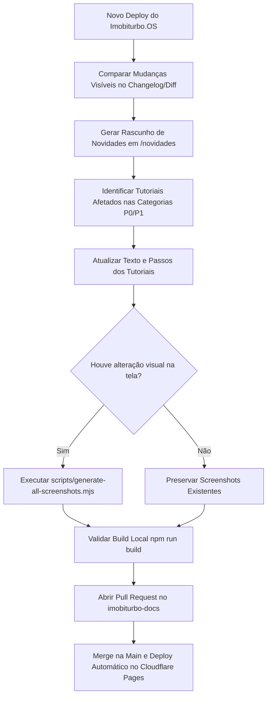
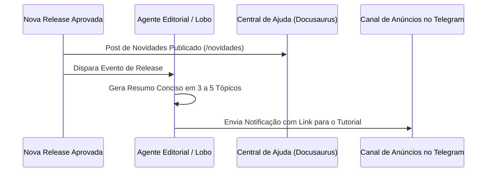

# Guia de Manutenção e Evolução da Central de Ajuda

Este documento descreve o fluxo de trabalho recomendado para manter a Central de Ajuda do **Imobiturbo.OS** sempre atualizada e sincronizada com os lançamentos de novas versões do CRM.

---

## 1. Fluxo de Atualização Editorial Contínua

Sempre que uma nova versão do Imobiturbo.OS for lançada em produção (`os.imobiturbo.com.br`):

### Passo a Passo Operacional

1. **Revisão de Mudanças**: Inspecione o `CHANGELOG.md` e os commits recentes do repositório `imobiturbo-os-operacao`.
2. **Novidades Públicas**: Crie um novo post em `blog/AAAA-MM-DD-titulo.md` com a linguagem traduzida para o corretor/cliente final (evitando jargões como *migrations*, *schemas*, *workers*).
3. **Atualização de Guias**: Caso alguma funcionalidade tenha mudado de menu ou recebido novos botões, atualize o arquivo correspondente em `docs/`.
4. **Atualização de Imagens**: Execute `node scripts/generate-all-screenshots.mjs` apenas se houver novos campos ou mudanças no layout.
5. **Verificação de Build**: Rode `npm run build` para garantir ausência de links quebrados.

---

## 2. Proposta de Integração Futura com Telegram (via Lobo)

Como evolução futura da comunicação com clientes e operadores:

- **Gatilho**: Publicação aprovada na branch `main`.
- **Formato**: Mensagem curta e amigável destacando os 3 maiores ganhos de produtividade para os corretores.
- **Link**: Botão de direcionamento direto para o artigo correspondente na Central de Ajuda (`docs.imobiturbo.com.br`).
